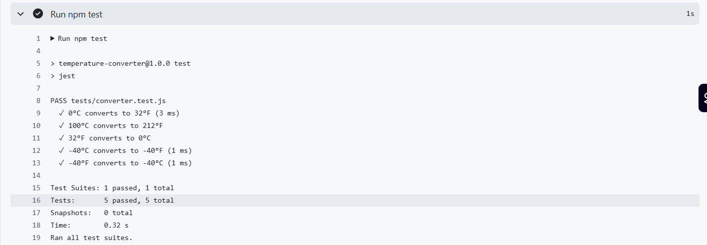
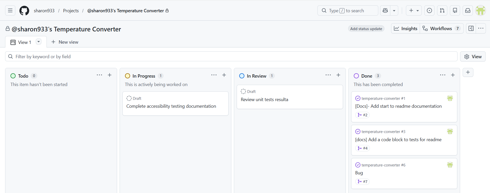
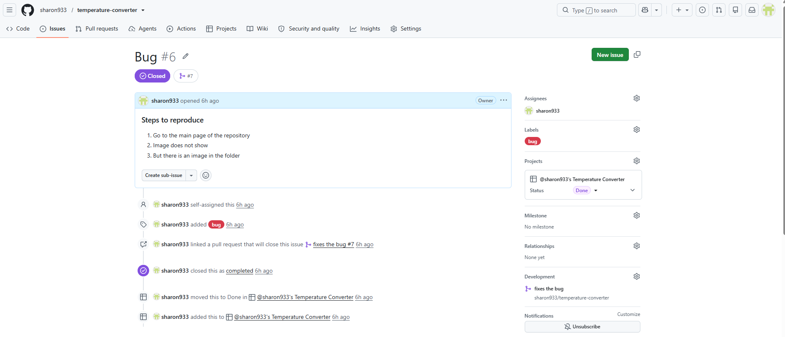
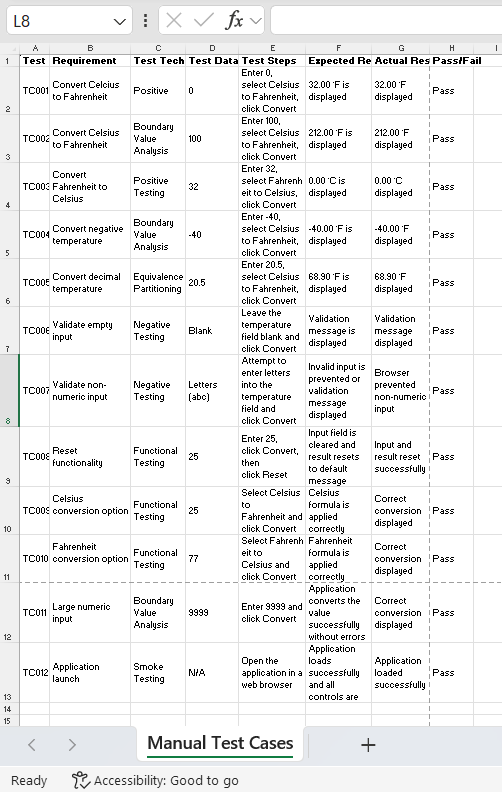

# Temperature Converter

A simple web app for converting temperatures between Celsius (°C) and Fahrenheit (°F). Built with vanilla HTML, CSS, and JavaScript, with unit tests written in Jest and continuous integration via GitHub Actions.

## Features

- Convert Celsius to Fahrenheit and Fahrenheit to Celsius
- Radio buttons to choose the conversion direction
- Input validation (warns on empty or non-numeric input)
- Results rounded to two decimal places
- Reset button to clear the input and result
- Clean, card-based interface using the Montserrat font
- Unit-tested conversion logic
- Automated tests run on every push and pull request

## Getting Started

### Prerequisites

- [Node.js](https://nodejs.org/) (version 18, 20, or 22) — required only for running the tests

### Installation

Clone the repository:

```bash
git clone https://github.com/sharon933/temperature-converter.git
cd temperature-converter
```

Install the development dependencies:

```bash
npm install
```

### Testing 
An example of my unit test 
```


const {
 
    celsiusToFahrenheit,
 
    fahrenheitToCelsius
 
} = require('../converter');
 
  
 
test('0°C converts to 32°F', () => {
 
    expect(celsiusToFahrenheit(0)).toBe(32);
 
}); 

```

### Continuous Integration

I have set up continous integratin so that the tests are running and passing in the cloud. I made sure the tests were passing. I sued Github Actions in the market place to get my `yaml` file. 


 
 This is how to make images
 

 ### Project Management

 This section will cover the project management details of the project. 
 
 Effective project management was an important part of the development process because it provided a structured approach to planning, organising and monitoring the work throughout the project. Rather than attempting to develop the entire application at once, the project was broken down into a series of smaller, manageable tasks. This made it easier to prioritise activities, monitor progress and ensure that the application, testing and documentation were completed within the available timeframe. Adopting a structured project management approach also reduced the likelihood of overlooking important requirements and helped maintain a logical development workflow. 

GitHub Projects was selected as the project management tool because it integrates directly with GitHub Issues, branches and Pull Requests, providing a single location to manage both development activities and project documentation. A Kanban methodology was chosen because it offers a simple visual workflow that allows tasks to be monitored as they progress through different stages of completion. Unlike more complex project management approaches, Kanban was well suited to this project because it provided flexibility while maintaining a clear overview of the remaining work. 

The Kanban board was organised into four stages: To Do, In Progress, In Review and Done. As work progressed, individual tasks were moved between each stage to reflect their current status. This allowed development activities, testing tasks and documentation updates to be tracked throughout the project while providing a clear visual indication of overall progress. Using the Kanban board also helped prioritise the remaining work and ensured that development, testing and documentation activities progressed together rather than being completed independently. 

Individual GitHub Issues were created to represent development tasks and documentation updates. Breaking the project into smaller tasks made the overall project easier to manage and ensured that each feature could be completed and verified before moving on to the next stage. Once a task had been completed, the associated changes were committed locally using Git, pushed to GitHub and submitted through a Pull Request before being merged into the main branch. This workflow helped to give clear traceability between planning the project, implementation and then the completed functionality. 

The Kanban board also demonstrated the complete lifecycle of individual pieces of work. Tasks moved through the workflow from To Do, to In Progress, followed by In Review, before finally being moved to Done once the work had been completed and verified. This approach ensured that every task followed a structured process rather than being completed without review, making it easier to monitor progress throughout the project. 

One example of this workflow was the bug shown in Figure X. During development an issue was identified where an image was present within the repository but was not displaying correctly within the README. A GitHub Issue was created to document the problem, including clear reproduction steps describing how the issue could be observed. The issue was labelled as a bug, assigned to the project, linked to a dedicated Pull Request and subsequently resolved. Once the fix had been verified, the Pull Request was merged into the main branch, the issue was automatically closed and the task was moved to the Done column on the Kanban board. This demonstrated how GitHub Projects, Issues and Pull Requests worked together to provide traceability from defect identification through to implementation and resolution. 

Using this workflow throughout the project helped to provide a structured and organised approach to development. It also created a clear history or list of project activities, allowing completed work, documentation updates and bug fixes to be traced through commits, Pull Requests and project board updates. This approach reflects common software development practices used within Agile environments and helped ensure that work was completed in a controlled, organised and manageable manner. 

 ### GitHub Kanban Board

 The screenshot below shows the GitHub Projects Kanban board that was used to organise and track the progress of the project throughout development. 

  

 ### Defect Management 

 The screenshot below demonstrates how a software defect was recorded as a GitHub Issue, linked to a Pull Request, resolved and then moved to the Done column once the fix had been verified. 




 ### Manual Testing

 Although unit testing was incorporated using Jest to verify the temperature conversion functions, manual testing was also carried out to ensure my application functioned correctly from a user's perspective. Manual testing was important because it allowed the complete user journey to be tested and verified, including interaction with the graphical user interface, input validation, conversion options and the reset functionality. Through this approach, I ensured that the application behaved as expected when used in a web browser rather than only confirming that the conversion functions returned the correct values and performed correct calculations. 

To record the testing process, a structured Microsoft Excel spreadsheet was created. The spreadsheet documented each test case using a consistent format that included the Test ID, requirement being tested, testing technique, representative test data, test steps, expected result, actual result and overall status – whether it passed or failed. Recording the results in this way provided a clear and structured audit trail of the testing activities undertaken and made it easier to verify that each functional requirement had been successfully tested. 

I tried to use a range of recognised software testing techniques when designing the manual test cases. Positive testing was performed to verify that valid Celsius and Fahrenheit values produced the correct conversions. Negative testing was used to ensure that invalid scenarios, such as leaving the input field blank or attempting to enter non-numeric data, were handled appropriately by the application. Boundary Value Analysis was applied by testing values such as -40°C and 100°C to ensure that the conversion logic remained accurate at important boundary conditions. Equivalence Partitioning was demonstrated by testing decimal values such as 20.5°C, confirming that values from the same input category produced the expected results. A simple smoke test was also performed to confirm that the application loaded successfully before detailed functional testing began. 

Representative test data was selected to demonstrate a range of realistic scenarios. This included common temperatures, decimal values, negative temperatures and large numeric values. These tests provided confidence that the application could correctly process different categories of input while maintaining accurate conversion calculations. The results recorded within the spreadsheet showed that every planned manual test case passed successfully, providing confidence that the application's core functionality operated correctly. The spreadsheet shows that from all twelve test cases, all have a status of pass. 

Additionally, I would like to further discuss the results of the manual testing I conducted shown in Figure X. The spreadsheet demonstrates that a small range of representative test cases were executed to verify both the functional behaviour of the application and its input validation. Test data was selected to cover positive, negative and boundary value scenarios to provide confidence that the application would behave correctly under different conditions. 

For example, TC001 and TC003 verified that the application correctly converted standard Celsius and Fahrenheit values, whilst TC002 and TC004 used important boundary values such as 100°C and -40°C to confirm that the conversion formula remained accurate. Decimal input was also tested (TC005) to ensure that the application could correctly process temperatures containing decimal places rather than only whole numbers. 

The manual tests also focused on validating user interaction with my application. TC006 and TC007 confirmed that invalid input was handled correctly by displaying validation or preventing non-numeric input, whilst TC008, TC009 and TC010 verified that the Reset button and conversion options functioned as intended. All manual test cases achieved the expected result and were recorded as Pass, demonstrating that the application's core functionality operated successfully.


My manual test spreadsheet table helps to show a structured approach to testing the software. A screenshot or Figure A of the spreadsheet has been included below to illustrate the documented test cases and their corresponding results. 

  

 